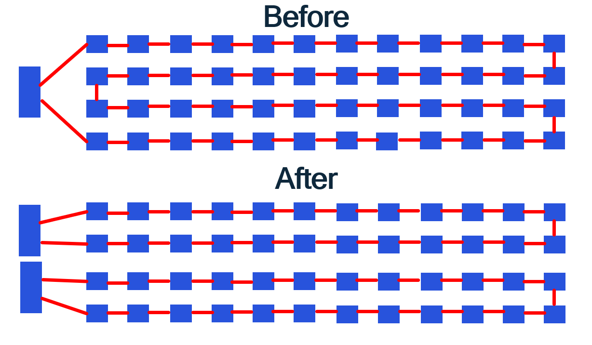

# Datathon_2022
[Team Patata's solution for Qualcomms challenge](https://devpost.com/software/qualcomm_project)

# Statement
# One driver to rule them all 

To create a chip, we need to deliver the power everywhere. In order to do so, a lot of power switches are placed all over the design. They all have to be connected and routed together in a chain. The faster you turn these power switches on and off, the less power you use.

Here, the challenge begins! We want to create independent groups of power switches so that we reduce the turn off/on time such as bellow :




A power switch is a type of cell that is inserted inside the design. Each cell has one input pin (conn_out) and one output pin (conn_in). Two power switches are connected through a net from the output pin of the previous switch to the input pin of the next switch.

## Inputs 
As an input, you will have a .def file containing all the informations of the design as follow :

**File header**

The .def file contains a lot of unused data in this case. We don't have to care about the file header.

**Driver pins**
```
- DRIVERPIN_0 + NET DRIVERPIN_0 + DIRECTION INPUT + USE SIGNAL
  + LAYER CIA ( -38 0 ) ( 38 790 )
  + FIX ( 0 408119 ) E ;
```

- DRIVERPIN_0: Name of the driver pin.
- \+ LAYER CIA ( -38 0 ) ( 38 790 ): The layer information (does not matter here).
- \+ FIX ( 0 408119 ): Coordinates x and y of the driver pin.

Every chain should start at an input driver pin and end at an ouput driver pin. Driver pins DO NOT have to be connected for the solution to be valid. A total of 32 driver pins are provided (16 inputs, 16 outputs).

A driver pin can only be used once.

**Pin**
```
pin_name cell_name + FIXED ( x y ) N ;
```

- pin_name: The name of the pin.
- cell_name: Cell name (does not matter here).
- \+ FIXED : Type of insertion (does not matter her).
- x, y : position of the pin.
- N: Orientation (does not matter here).

All the pins should be connected in a chain for a solution to be valid.

## Output
As an output, we expect a file containing the net connections.

**Net connection**
```
- net_name
  ( first_pin_name conn_in )
  ( second_pin_name conn_out )
;
```
- net_name: The name of the net (does not matter here).
- first_pin_name: First pin of the connection.
- second_pin_name: Second pin of the connection.
- conn_in: Input pin (**constant**)
- conn_out: Output pin (**constant**)

## What we evaluate

You should be provided with an example of input file as well as an associated output file (generated with a bogus solver). You are also provided with 5 test cases you can use to test your solution.

We will have 10 private test cases (to which you do not have access) to test your solutions. We will test the following:

- Check that all the pins (except driver pins) are routed exactly once.
- Check that all the chains created start and end at the driver.
- Measure the average length of the created chains (using the [Manhattan distance](https://en.wikipedia.org/wiki/Taxicab_geometry)).
- Measure the efficiency of your program. 
- A visualisation of your solution will provide bonus points in our evaluation.
